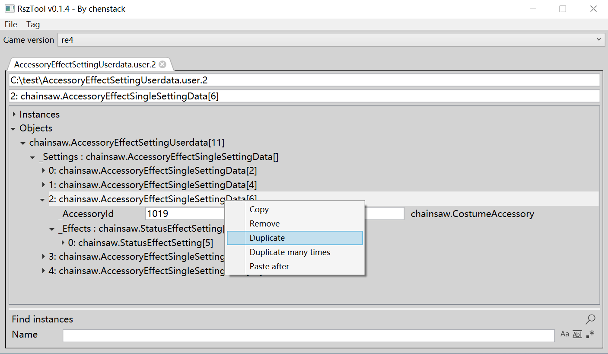

# RszTool

## About this project

RszTool is a tool that edit and create resource file for RE ENGINE game. Currently support .user, .pfb and .scn files.  
RszTool is inspired by [RE_RSZ](https://github.com/alphazolam/RE_RSZ) and [EMV-Engine/RE Engine Resource Editor](https://github.com/alphazolam/EMV-Engine) by alphazolam.  
RszTool also provide some advanced operations like copy/paste/remove/duplicate for instance array/game object.  
RszTool is developed with C# and WPF. You can also use RszTool.dll as a C# library to do some batch work.  

## Why I make this tool

- RE_RSZ is a good tool. But it is 010 Editor Binary Template, so it need refresh action when struct changed. And sometimes it take several minutes to open a complex file. Also it lacked some advanced operations like copy/paste for hierarchical instance/game object. You need manual create many instances and set object index to another instance.
- EMV-Engine/RE Engine Resource Editor is a reframework lua script. You need to open the game first to use it. It provide limited file access. For example, it is not convenient to open file or drop file into it. It provide some function like adding item inspire me.

I want a faster and rich functional tool to edit resource file. So I make this tool.

## How to use this tool

- Download the latest release [here](https://github.com/czastack/RszTool/releases).
- You need to copy rszxxx.json to the same folder of RszTool.App.exe from RE_RSZ manually.
- Currently, RszTool.App support Chinese and English, it will choose language according to your system culture.
- RszPatchs/rszxxx_patch.json will replace some data in rszxxx.json. Because sometimes auto detected type for "Data" type is not correct.
- You can Click File/Open menu or drag and drop file to RszTool.App window to open it.
- Right click for array item/game object to see some operation context menu. I think it is good to use.
  
- You can search instances and game objects in bottom of the page.

## How to build this project

RszTool support .net framework 4.7.2 and .net8, you can also change it in .csproj file.
1. Install [.net8 SDK](https://dotnet.microsoft.com/zh-cn/download/dotnet/8.0)
2. cd RszTool.App folder and run "dotnet build -f net8.0-windows" or "dotnet build -f net472"
3. You can also build it by Visual Studio 2022.

## project struct

1. RszTool
    - The core library of RszTool. Provide functions to read/write/edit resource file.
2. RszTool.App
    - The gui application of RszTool.
3. RszTool.Test
    - Some example to show basic usage of RszTool.dll, like file open/read/write/save.

## License

RszTool is under MIT license. See LICENSE for more detail.
